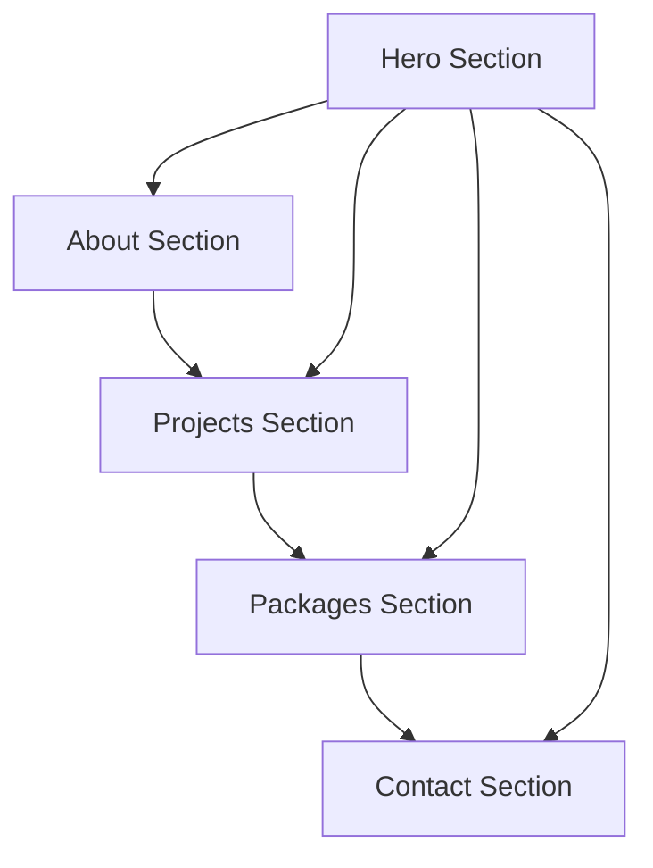

# Flutter Developer Portfolio Website - Product Requirements Document

## 1. Product Overview
A professional single-page portfolio website showcasing expertise as a Flutter app developer, featuring comprehensive sections for personal branding, project showcase, and professional contact information. The website serves as a digital business card and project showcase for Sushanta Kumar Behera, demonstrating technical skills and professional experience in Flutter development.

## 2. Core Features

### 2.1 User Roles
No user role distinction is necessary for this portfolio website - it serves as a public showcase accessible to all visitors.

### 2.2 Feature Module
Our Flutter developer portfolio consists of the following main sections:
1. **Hero Section**: Professional introduction with "I am a Flutter app developer" statement, profile image, and navigation menu.
2. **About Section**: Professional profile information sourced from LinkedIn, including experience, skills, and career highlights.
3. **Projects Section**: GitHub repository showcase with project descriptions, technologies used, and live links.
4. **Packages Section**: Published Flutter packages from pub.dev with descriptions and usage statistics.
5. **Contact Section**: Professional contact information and social media links.

### 2.3 Page Details

| Page Name | Module Name | Feature description |
|-----------|-------------|---------------------|
| Portfolio Page | Hero Section | Display professional introduction with "I am a Flutter app developer", profile image from LinkedIn, smooth scroll navigation menu |
| Portfolio Page | About Section | Show professional experience from LinkedIn including current role at Binimise Labs, previous positions at Socially X, skills in Flutter/Swift/Dart, location and work history |
| Portfolio Page | Projects Section | Display GitHub projects including Teams Tracker, Player Pedia, Swadesic, Seed Hacker, Open AI, and On Chain apps with descriptions, tech stacks, and repository links |
| Portfolio Page | Packages Section | Showcase pub.dev packages including date_change_checker with version info, download stats, platform compatibility, and package links |
| Portfolio Page | Contact Section | Provide professional contact information, LinkedIn profile link, GitHub profile link, and email contact form |

## 3. Core Process
Visitors can navigate through the single-page website using smooth scrolling navigation or by scrolling naturally. The main user flow involves:
1. Landing on hero section with immediate professional introduction
2. Scrolling through about section to learn about experience and skills
3. Exploring projects section to view technical capabilities
4. Reviewing packages section to see published contributions
5. Accessing contact section for professional inquiries

## 4. User Interface Design

### 4.1 Design Style
- **Primary Colors**: Deep blue (#1e3a8a) and accent green (#10b981) reflecting Flutter branding
- **Secondary Colors**: Light gray (#f8fafc) backgrounds with dark text (#1f2937)
- **Button Style**: Rounded corners with subtle shadows and hover animations
- **Typography**: Inter or Roboto font family, 16px base size, clear hierarchy with 24px+ headings
- **Layout Style**: Clean card-based design with generous whitespace, sticky navigation header
- **Icons**: Feather icons or Heroicons for consistency, Flutter logo prominently featured

### 4.2 Page Design Overview

| Page Name | Module Name | UI Elements |
|-----------|-------------|-------------|
| Portfolio Page | Hero Section | Full-height section with centered content, professional headshot (circular), large typography for name and title, animated Flutter logo, gradient background |
| Portfolio Page | About Section | Two-column layout on desktop, timeline-style experience cards, skill badges with Flutter/Dart/Swift icons, company logos |
| Portfolio Page | Projects Section | Grid layout (3 columns desktop, 1 mobile), project cards with screenshots, hover effects revealing tech stack, GitHub and live demo buttons |
| Portfolio Page | Packages Section | Horizontal cards showing package info, download counters, version badges, pub.dev styling consistency |
| Portfolio Page | Contact Section | Centered contact form, social media icon links, professional email display, subtle background pattern |

### 4.3 Responsiveness
Mobile-first responsive design with breakpoints at 768px (tablet) and 1024px (desktop). Touch-optimized interactions for mobile devices with appropriate button sizes and spacing.

## 5. Content Specifications

### 5.1 Professional Information
- **Name**: Sushanta Kumar Behera
- **Current Role**: Senior Software Engineer at Binimise Labs (Mar 2025 - Present)
- **Location**: Bengaluru, Karnataka, India (Remote)
- **Previous Experience**: 
  - Software Development Engineer I at Socially X (Jan 2022 - Jan 2025)
  - Software Development Engineer I in Hyderabad, Telangana (Jan 2022 - Jan 2025)
- **Core Skills**: Flutter, Swift, Dart, Mobile Applications, Hive, NoSQL

### 5.2 Featured Projects
1. **Teams Tracker** (Android and iOS) - Face-based attendance with facial recognition, automated reports, secure & reliable
2. **Player Pedia** (Android and iOS) - Offline cricket player data management with Hive storage
3. **Swadesic** (Android and Web) - E-commerce and social networking platform for Swadeshi products
4. **Seed Hacker** (Android, iOS, Mac) - Ethereum wallet creation and balance checking
5. **Open AI** (Android and iOS) - AI chat application
6. **On Chain** (Android and iOS) - Live crypto coin prices and blockchain data

### 5.3 Published Packages
- **date_change_checker** v2.0.1 - Cross-platform Flutter package detecting device date/time changes, Dart 3 compatible, supports Android and iOS