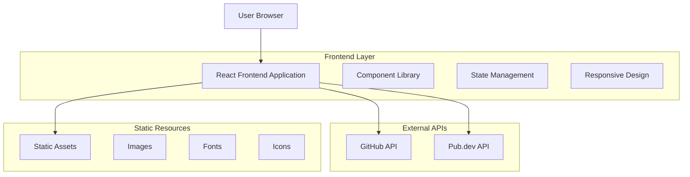
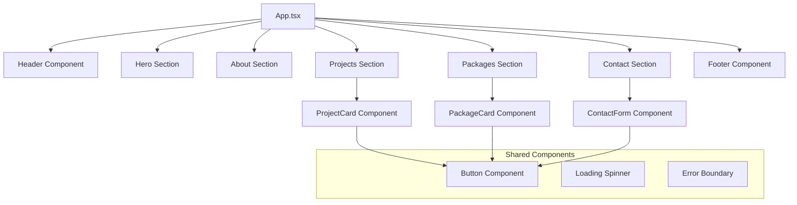

# Flutter Developer Portfolio - Technical Architecture Document

## 1. Architecture Design



## 2. Technology Description

* Frontend: React\@18 + TypeScript\@5 + Tailwind CSS\@3 + Vite\@5

* State Management: React Context API + useState/useEffect hooks

* HTTP Client: Axios for API calls

* Icons: Lucide React icons

* Animations: Framer Motion

* Deployment: Static hosting (Netlify/Vercel compatible)

## 3. Route Definitions

| Route      | Purpose                                                                            |
| ---------- | ---------------------------------------------------------------------------------- |
| /          | Single-page portfolio with all sections (Hero, About, Projects, Packages, Contact) |
| /#hero     | Direct link to hero section                                                        |
| /#about    | Direct link to about section                                                       |
| /#projects | Direct link to projects section                                                    |
| /#packages | Direct link to packages section                                                    |
| /#contact  | Direct link to contact section                                                     |

## 4. API Definitions

### 4.1 GitHub API Integration

**Fetch User Repositories**

```
GET https://api.github.com/users/error404sushant/repos
```

Response:

| Param Name        | Param Type | Description                  |
| ----------------- | ---------- | ---------------------------- |
| name              | string     | Repository name              |
| description       | string     | Repository description       |
| html\_url         | string     | Repository URL               |
| language          | string     | Primary programming language |
| stargazers\_count | number     | Number of stars              |
| updated\_at       | string     | Last update timestamp        |

**Fetch User Profile**

```
GET https://api.github.com/users/error404sushant
```

Response:

| Param Name    | Param Type | Description                   |
| ------------- | ---------- | ----------------------------- |
| login         | string     | GitHub username               |
| avatar\_url   | string     | Profile image URL             |
| bio           | string     | User biography                |
| public\_repos | number     | Number of public repositories |
| followers     | number     | Number of followers           |

### 4.2 Pub.dev API Integration

**Fetch Publisher Packages**

```
GET https://pub.dev/api/publishers/143tech.site/packages
```

Response:

| Param Name                 | Param Type | Description                |
| -------------------------- | ---------- | -------------------------- |
| packages                   | array      | List of published packages |
| name                       | string     | Package name               |
| latest.version             | string     | Latest version             |
| latest.pubspec.description | string     | Package description        |

## 5. Component Architecture



## 6. Data Models

### 6.1 TypeScript Interfaces

```typescript
// GitHub Repository Interface
interface GitHubRepo {
  id: number;
  name: string;
  description: string;
  html_url: string;
  language: string;
  stargazers_count: number;
  updated_at: string;
  topics: string[];
}

// GitHub User Interface
interface GitHubUser {
  login: string;
  avatar_url: string;
  bio: string;
  public_repos: number;
  followers: number;
  following: number;
}

// Pub.dev Package Interface
interface PubDevPackage {
  name: string;
  latest: {
    version: string;
    pubspec: {
      description: string;
      homepage?: string;
    };
  };
}

// Professional Experience Interface
interface Experience {
  id: string;
  company: string;
  position: string;
  duration: string;
  location: string;
  description: string;
  skills: string[];
}

// Contact Form Interface
interface ContactForm {
  name: string;
  email: string;
  subject: string;
  message: string;
}
```

## 7. File Structure

```
src/
├── components/
│   ├── common/
│   │   ├── Button.tsx
│   │   ├── LoadingSpinner.tsx
│   │   └── ErrorBoundary.tsx
│   ├── sections/
│   │   ├── Header.tsx
│   │   ├── Hero.tsx
│   │   ├── About.tsx
│   │   ├── Projects.tsx
│   │   ├── Packages.tsx
│   │   ├── Contact.tsx
│   │   └── Footer.tsx
│   └── cards/
│       ├── ProjectCard.tsx
│       ├── PackageCard.tsx
│       └── ExperienceCard.tsx
├── hooks/
│   ├── useGitHub.ts
│   ├── usePubDev.ts
│   └── useScrollSpy.ts
├── services/
│   ├── githubApi.ts
│   ├── pubdevApi.ts
│   └── emailService.ts
├── types/
│   └── index.ts
├── utils/
│   ├── constants.ts
│   └── helpers.ts
├── styles/
│   └── globals.css
├── App.tsx
└── main.tsx
```

## 8. Performance Optimization

* **Code Splitting**: Lazy loading for non-critical components

* **Image Optimization**: WebP format with fallbacks, responsive images

* **API Caching**: Cache GitHub and Pub.dev responses for 5 minutes

* **Bundle Optimization**: Tree shaking and minification via Vite

* **SEO**: Meta tags, Open Graph tags, structured data

## 9. Deployment Strategy

* **Build Process**: `npm run build` generates optimized static files

* **Hosting**: Static hosting on 143tech.site domain

* **CI/CD**: GitHub Actions for automated deployment

* **Domain**: Custom domain configuration with SSL certificate

* **Performance**: CDN integration for global content delivery

## 10. Security Considerations

* **API Rate Limiting**: Implement client-side rate limiting for GitHub API

* **Environment Variables**: Secure API keys (if needed) via environment variables

* **Content Security Policy**: Implement CSP headers for XSS protection

* **HTTPS**: Enforce HTTPS for all communications

* **Input Validation**: Sanitize contact form inputs before processing

